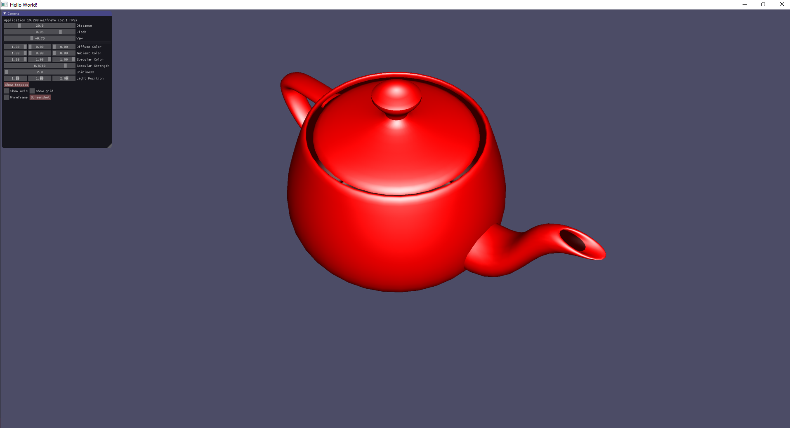

# CGRA 354: Assignment 2 - Report

## Part 1: Transformations and shading (15 points)

### Core (8 points)

In this task, I implemented orbital camera controls where the camera focuses on a specific point in the scene. The camera can be rotated using yaw and pitch, and its distance from the point can be adjusted. These controls are accessible both through an ImGui interface and through mouse input. With ImGui, sliders allow me to adjust the yaw, pitch, and distance interactively. The mouse, on the other hand, enables me to change the yaw by dragging along the x-axis and the pitch by dragging along the y-axis. Additionally, scrolling the mouse wheel adjusts the distance of the camera from the focal point.

 

 

For the shading model, I used the Phong shading model to illuminate objects. Through the ImGui interface, I added controls to interactively change the ambient and diffuse colors, specular color, and shininess of the material. The lighting in the scene is set to either a point light positioned at the camera or a directional light that matches the camera's orientation. This gives the user full control over the visual appearance of objects, making the scene both interactive and visually adjustable in real-time.

 

 

### Completion (5 points)

I created at least 100 objects, each with the same model but positioned, rotated, scaled, and given different material colors to make them unique in the scene.I made sure to reuse the already loaded shader and mesh, which meant that the objects were not reloaded from the disk, optimizing performance. 

To achieve this, I used instancing, which allowed me to efficiently draw all the objects with a single draw call. For each object, I applied different transformations, such as translation, rotation, and scaling, stored in an array of model matrices. This method ensured that each object was rendered with its own unique properties while still maintaining the shared mesh and shader. 

> [!NOTE]
> Click button "Show teapots" to display many teapots from one object.

 

 

#### Part 2
- Not completed

### Challenge (2 point)
- Not completed