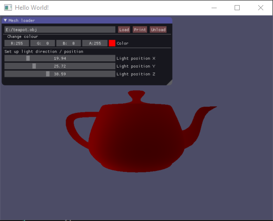
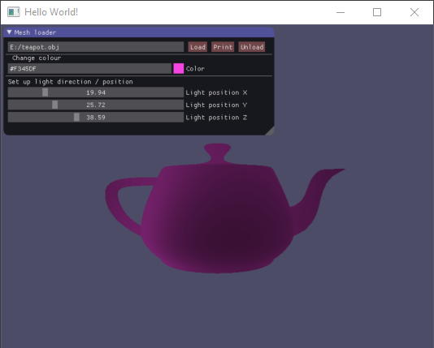
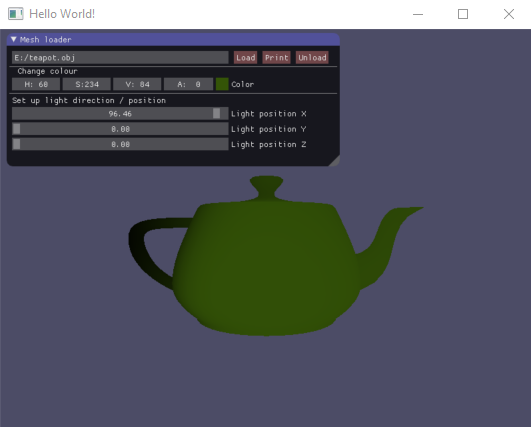

# CGRA 354: Assignment 1 - Report

## Part 1: Geometry and colour (10 points)

### Core (5 points)

In accordance with the requirements of this section of the task, a new class called `ObjFile::class` was created.
The following methods were implemented within this class:

##### Public Functions
`ObjFile::loadOBJ()`

- Loads mesh data from a `.obj` file.
- Reads vertex positions, normals, and indices based on the content of the file.
- The file path is provided through ImGui input controls.

`ObjFile::build()`

- Creates OpenGL buffers (VAO, VBO, EBO) to store vertex and index data.
- Configures vertex attributes using glVertexAttribPointer and glEnableVertexAttribArray.

`ObjFile::draw()`

- Binds the VAO and renders the mesh using glDrawElements.

`ObjFile::destroy()`

- Deletes the OpenGL buffers and clears the resources to avoid memory leaks.

`ObjFile::printMeshData()`

- Prints the current mesh data to the console for debugging purposes.
- This function is linked to an ImGui button for easy access.

 

 

To load an object, the absolute path to the file must be specified. If the file is loaded successfully, the user should see the object rendered in the application window.
> [!NOTE]
> Interaction functionality between the user and the application was not implemented, as it was not part of the task requirements.

### Completion (3 points)

This task involves integrating ImGui controls into the application to allow users to interactively select the colour of the displayed 3D model. 
The selected colour will then be passed to the shader program, where it will be applied to the model during rendering. 

 

 

The implementation allows users to interactively select the colour of the displayed 3D model using ImGui controls. 
The selected colour is then passed to the shader program, which applies it to the model during rendering. 
This solution provides an intuitive and interactive way for users to change the appearance of the model within the application. 

##### The steps involved include:

- Integrating ImGui controls for RGB colour selection. 
This widget was added to the ImGui window to capture RGB values for the model's colour. 
The user can interactively adjust the colour by manipulating the sliders or entering values directly.
- Modifying the shader to accept a uniform for the model's colour.
- Passing the selected colour from the application to the shader for rendering.
- This approach provides flexibility in real-time rendering and is easily extendable for more advanced features, such as texture mapping or lighting effects.

### Challenge (2 point)

This task involves improving the lighting controls to allow the user to interactively set the position or direction of the light source for the displayed 3D model. 
The goal is to provide user controls in the ImGui window that allow adjustment of the light's position or direction. 
These settings will then be passed to the shader program and applied to the shading calculations to affect how the model is lit. 

 

 

The implementation of interactive lighting controls provides the user with the ability to adjust the light's position dynamically.

##### The steps involved include:

- Adding ImGui controls to input XYZ light position.
- Modifying the shader program to accept these inputs as uniforms.
- Passing the light settings to the shader and applying them to the shading process.
By implementing these changes, users can interactively adjust the lighting of the scene.