# Assignment 4 - Ray Tracing Renderer

This project implements a CPU-based ray tracer that supports rendering scenes composed of multiple geometric primitives and light types, using various lighting and reflection models.

---

## Features

- **Ray generation** via camera parameters (position, orientation, FOV, resolution)
- **Intersection testing** with spheres, planes, disks, triangles
- **Multiple light types**: Directional and Point Lights
- **Lighting models**:
  - Ambient (indirect diffuse)
  - Lambertian diffuse
  - Blinn-Phong specular
- **Recursive reflections**
- **Textured materials**
- **Stochastic path tracing**

---

## Core Implementation

 
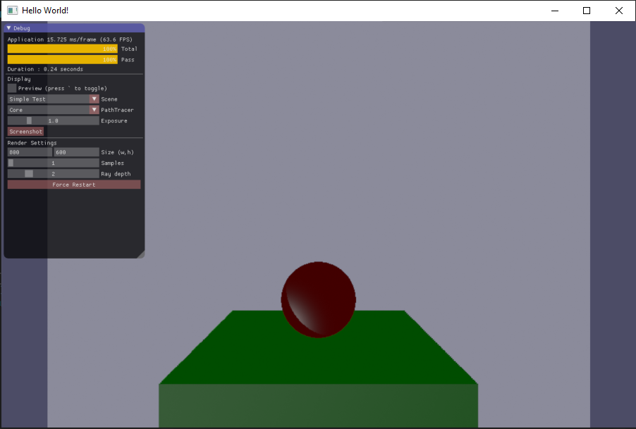
 

### 1. `Camera::generateRay`
- Implemented to compute rays from camera position using pixel coordinates.
- Converts pixel to normalized device coordinates, accounts for aspect ratio and FOV.
- Ray direction is transformed from camera space to world space using camera rotation.

### 2. `Sphere::intersect`
- Ray-sphere intersection computed using the quadratic formula.
- Handles cases for no hit, one hit (tangent), and two hits.
- Returns closest valid intersection, stores hit position, normal, and material.

### 3. `DirectionalLight` and `PointLight`
- Implemented occlusion checks using shadow rays.
- Directional light:
  - Tests shadows by casting rays in the opposite direction.
  - Returns constant irradiance.
- Point light:
  - Tests visibility toward light position.
  - Returns irradiance inversely proportional to squared distance.

 
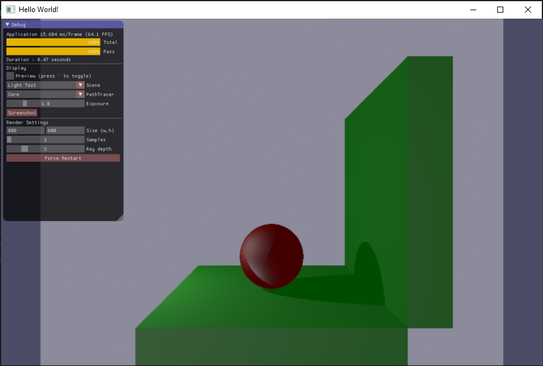
 

### 4. `CorePathTracer::sampleRay`
- Implements:
  - **Ambient (indirect diffuse)**: constant color for global illumination fallback.
  - **Lambertian diffuse**: light intensity modulated by angle between normal and light.
  - **Blinn-Phong specular**: uses half-vector and shininess for highlights.

 
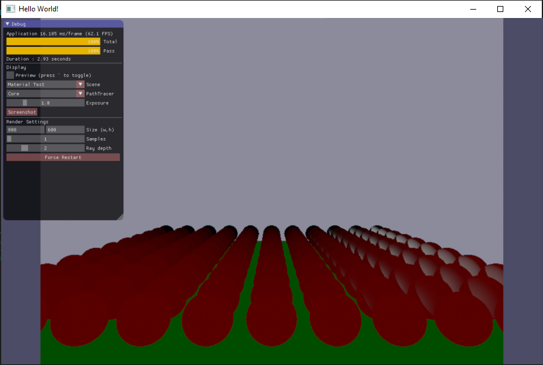
 
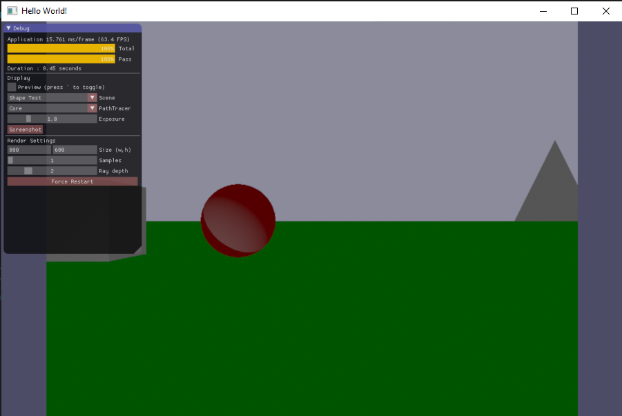
 
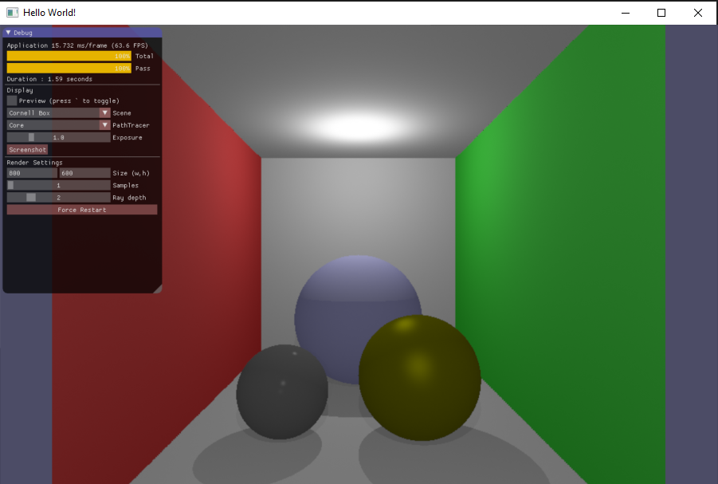
 
---

## Completion

 
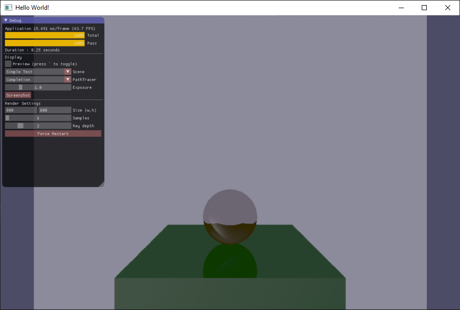
 

### 1. Shape Test Scene
- Extended the scene to include:
  - **Plane**
  - **Disk**
  - **Triangle**
- Verified that the ray tracer handles intersections with each shape correctly.

### 2. `CompletionPathTracer::sampleRay`
- Adds recursive specular reflections.
- Reflects rays using surface normals and `reflect()` function.
- Samples secondary rays to accumulate reflected light contribution.
- Reflection weight is based on material shininess.

 
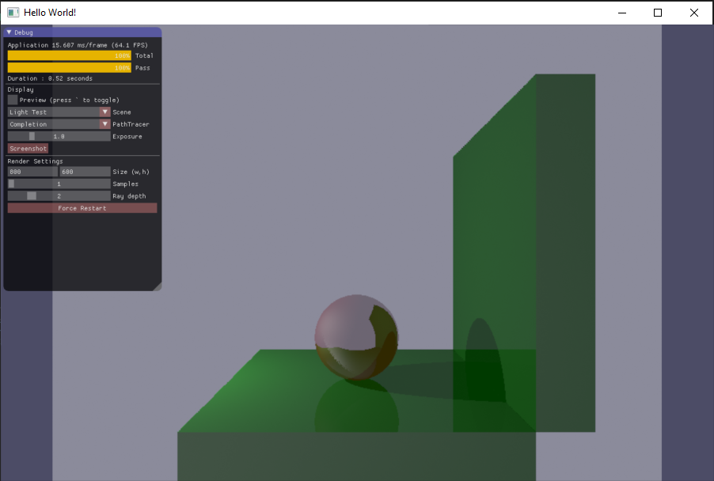
 
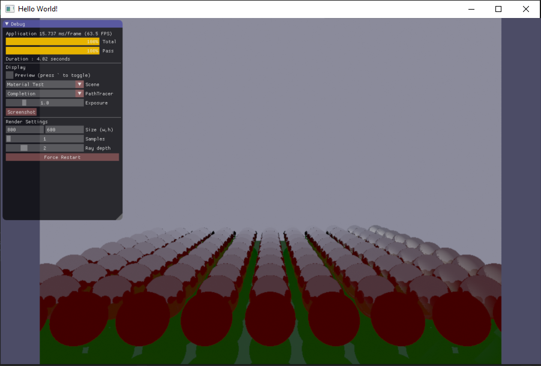
 
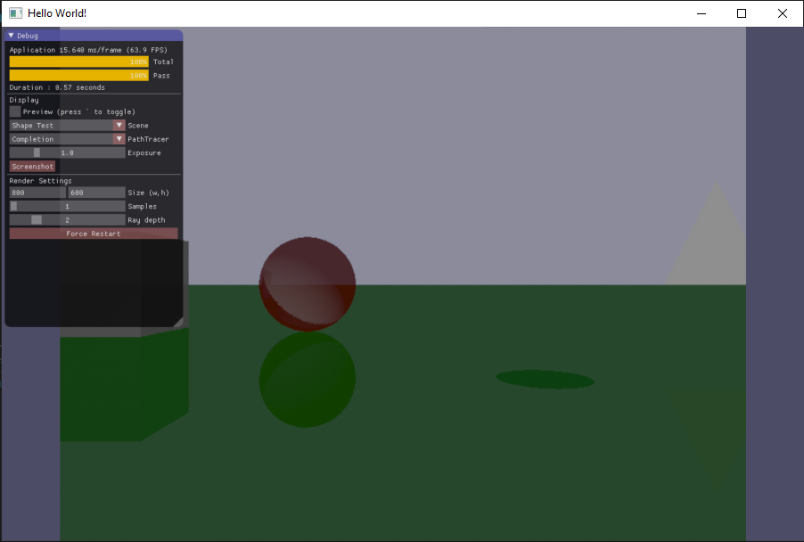
 
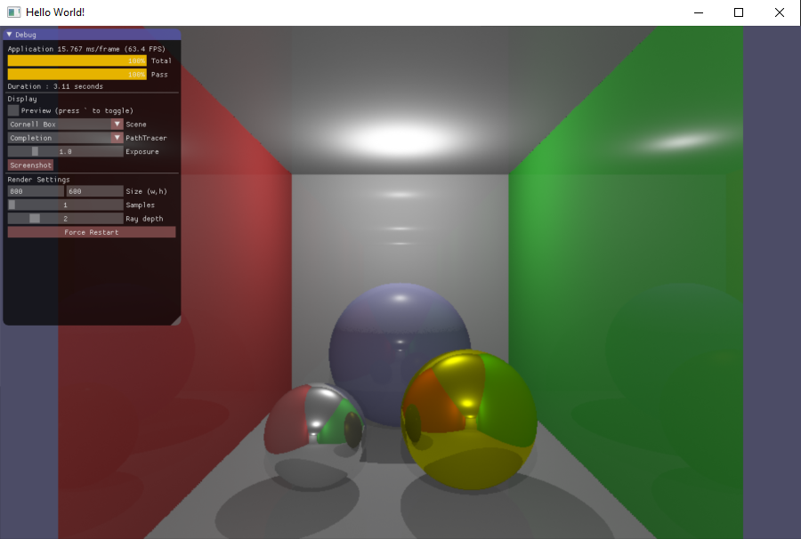
 

---

## 🔬 Challenge (3 points)

### 1. Textured Materials
- Implemented `Texture` class for image-based texture sampling.
- Added `TexturedMaterial` class that uses UV coordinates from hit info.
- Texture color modulates diffuse reflection.
- Supports common formats (PNG, JPG, etc.) using `stb_image`.

### 2. `ChallengePathTracer::sampleRay`
- Replaces fixed reflection models with **stochastic sampling**:
  - **Diffuse**: samples random direction in hemisphere around normal.
  - **Specular**: samples direction from Phong lobe using exponent based on shininess.
- Enables soft lighting and global illumination effects.
- Handles multiple bounces with Russian roulette termination or max depth.

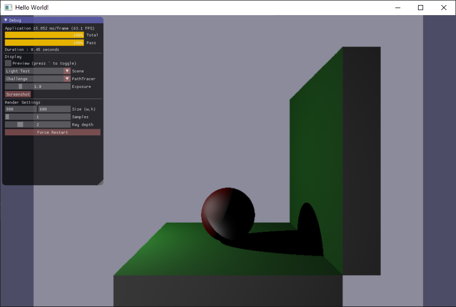
 
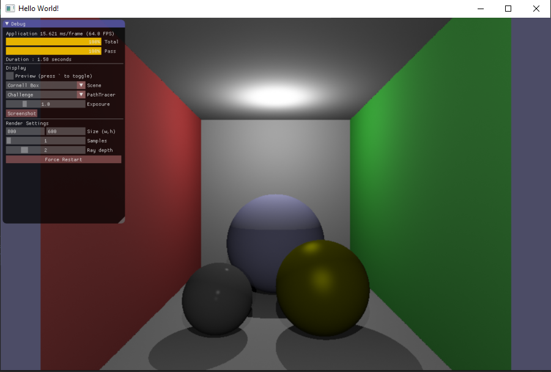
 